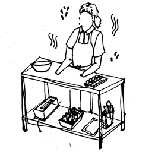
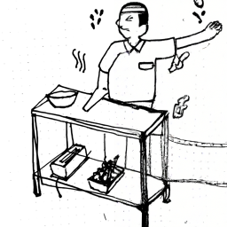
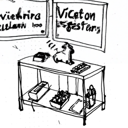
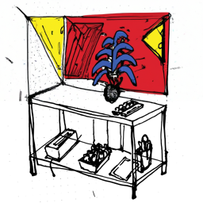
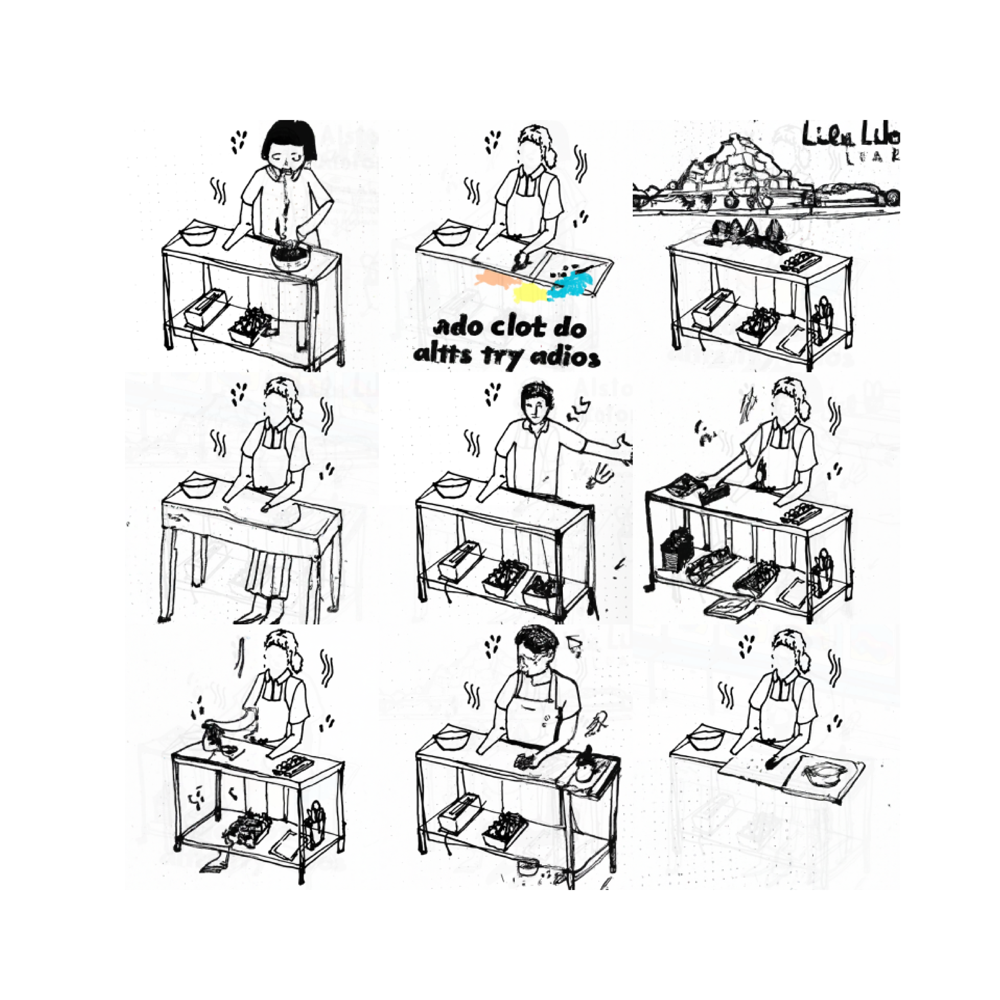

# Remixing Line Drawings with AI

People seem upset about AI "stealing" art and thus devaluing creators. I wanted to explore that idea by surreptitiously remixing my partner's line drawings with AI. She drew this unfinished baker:

<figure>
  
  <figcaption>Original line drawing by my partner</figcaption>
</figure>

## AI Remixes

I asked DALL-E to remix it. Here are the results:

  <figure>
    
    <figcaption>Sushi chef?</figcaption>
  </figure>

  <figure>
    
    <figcaption>Love it when AI tries to do text</figcaption>
  </figure>

  <figure>
    
    <figcaption>A splash of color, please</figcaption>
  </figure>

To be honest, they aren't that cool. My sense is that the appeal of generative AI in art is that it brings the cost (and skill) of remixing to zero. So I decided to make a collage of many of the remixes — which would maybe drive interest.

<figure>
  
  <figcaption>Collage of AI remixes</figcaption>
</figure>

She didn't seem particularly moved by any of this. Tough crowd!