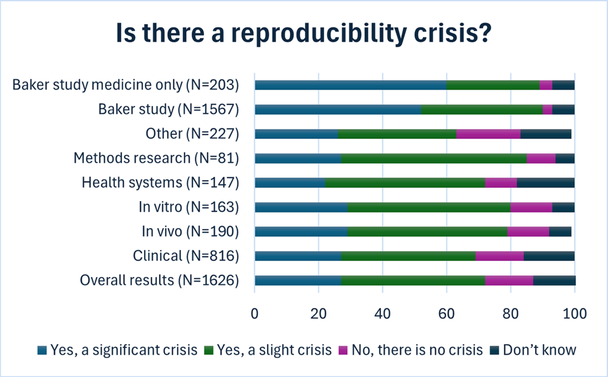

# Problem Statement

The biomedical research community faces a significant reproducibility crisis, with over 44% of replication attempts failing and widespread acknowledgment of systemic issues in research validation and reproduction.

# Key Requirements

- Need for better reproducibility standards in biomedical research
- Reform of incentive structures in academic publishing
- Improved institutional support for replication studies
- Clear distinction between reproducibility and meaningful reproduction

# Background

## Context

A recent PLOS Biology survey of 1,630 biomedical scientists revealed alarming statistics:
- 880 scientists attempted to replicate other researchers' experiments
- 724 failed in their replication attempts
- 25% couldn't reproduce their own work
- 72% agree there's a reproducibility crisis

## Similar Work
- Nature 2016 survey showing comparable replication failure rates
- Meta-analyses of reproducibility in biomedical research
- Studies on publication bias and the "file drawer" problem

## Key Challenges
- Pressure to publish novel findings over validation studies
- Lack of institutional support for replication efforts
- Misaligned incentives in academic career advancement
- Methodological proliferation without biological impact

# Success Criteria

- [ ] Increased funding allocation for replication studies
- [ ] Reformed peer review process emphasizing reproduction
- [ ] Improved metrics for evaluating scientific impact
- [ ] Reduced emphasis on vanity metrics (GitHub stars, citation counts)

# Resources

## Papers
- PLOS Biology 2024 Survey on Reproducibility
- Nature 2016 Reproducibility Survey
- Studies on predatory publishing impact

## Datasets
- Survey data from PLOS Biology study
- Publication metrics and replication success rates
- Institutional funding patterns for replication studies

# Notes for AI Agents

## Development Considerations
- Focus on logging and documentation standards
- Implement version control for research protocols
- Ensure computational reproducibility
- Track data transformations and timestamps

## Potential Pitfalls
- Over-emphasis on technical reproducibility vs. scientific value
- Neglect of fundamental research questions
- Chasing trendy metrics over substantial contributions

# Changelog 
- 2024-11-19: Initial draft based on (bogus) PLOS Biology survey
